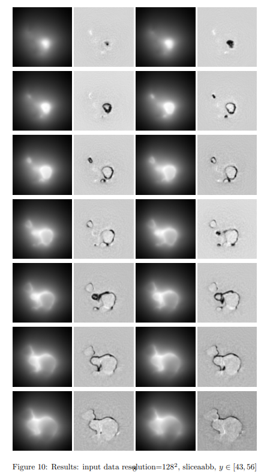

## Non-line-of-sight Imaging

​	In this assignment, we implement the filter backprojection (FBP) algorith fo NLOS imaging. The total work is divided into two parts. In the first part, we read the input data and construct the scene with bounding box. In the second part, we implement backprojection for the input data onto the constructed scene and use Laplace filter or threshold as post processing after calculating the heat map.

## Run

generate density grid

```bash
python densities.py
```

generate visualize results

```
python visualize.py
```

## Pictures folder
​	It includes the visualization of input data at different resolution and at different time steps.

## Videos folder
​	It includes the visualization of output data (slice of density grid along y-axis) by different input data.

## Results

